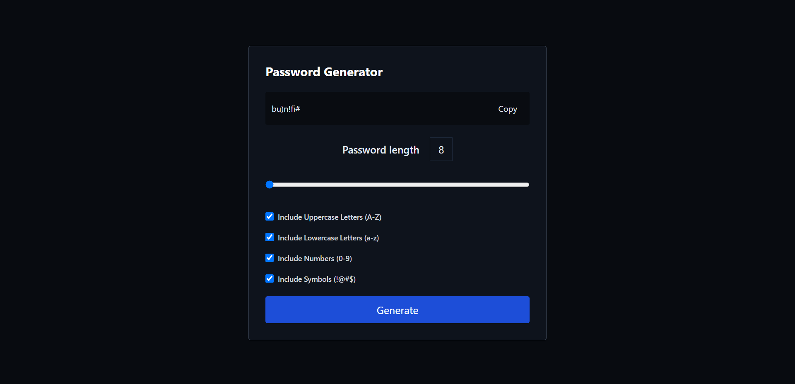

# Password Generator App

This is a simple web application for generating random passwords with various customizable options. It is built using React.

## Features

- Generate random passwords.
- Customize the password length.
- Include or exclude uppercase letters (A-Z), lowercase letters (a-z), numbers (0-9), and symbols (!@#$).
- Copy generated passwords to the clipboard.

## Usage

1. Clone this repository to your local machine.

   
2. Install the necessary dependencies using npm or yarn.

npm install or yarn install

3. Start the development server.

npm start or yarn start

4. Open your web browser and navigate to [http://localhost:3000](http://localhost:3000) to use the Password Generator App.

5. Customize your password preferences by checking or unchecking the options.

6. Click the "Generate" button to generate a random password.

7. Click the "Copy" button to copy the generated password to your clipboard.

## Password Customization

- You can change the default password length by moving the slider.
- Check or uncheck the checkboxes to include or exclude character types in your password.

## Author

- [Ayush Khatri](https://github.com/ayush-khatrii)

Feel free to contribute or report issues if you find any!

